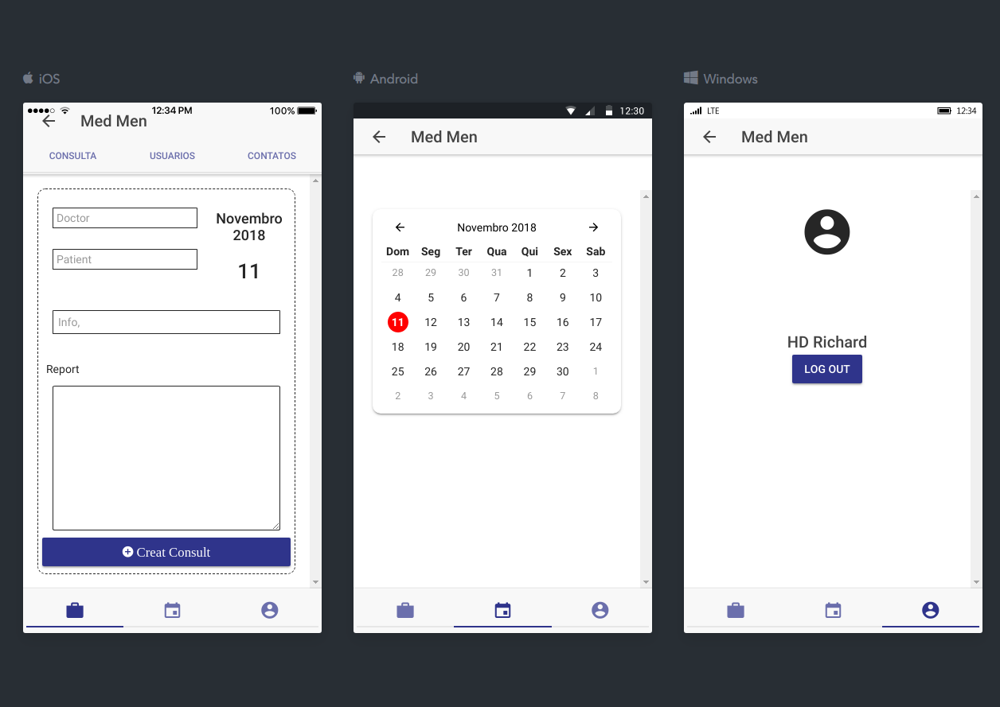
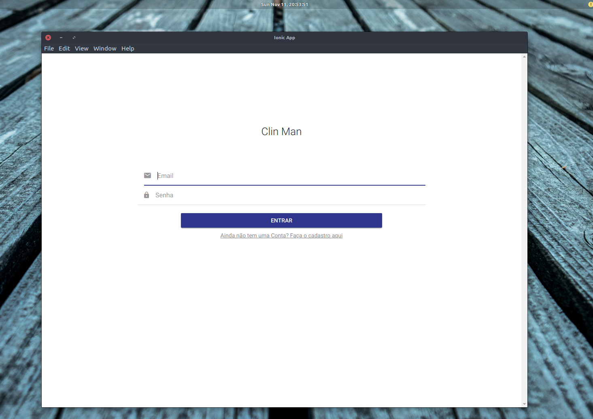
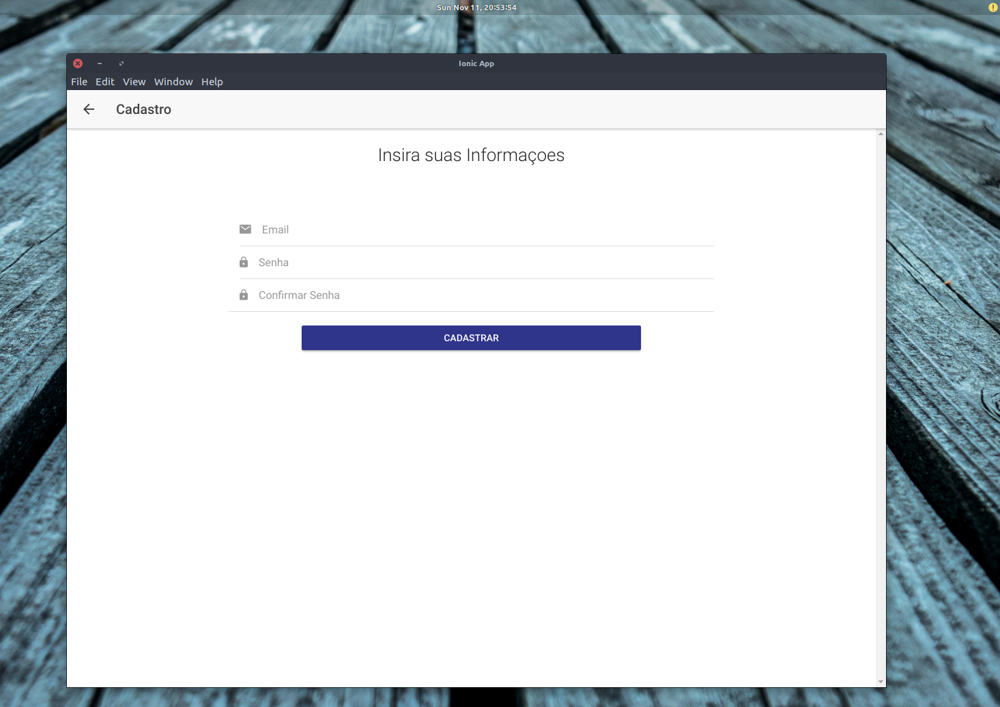
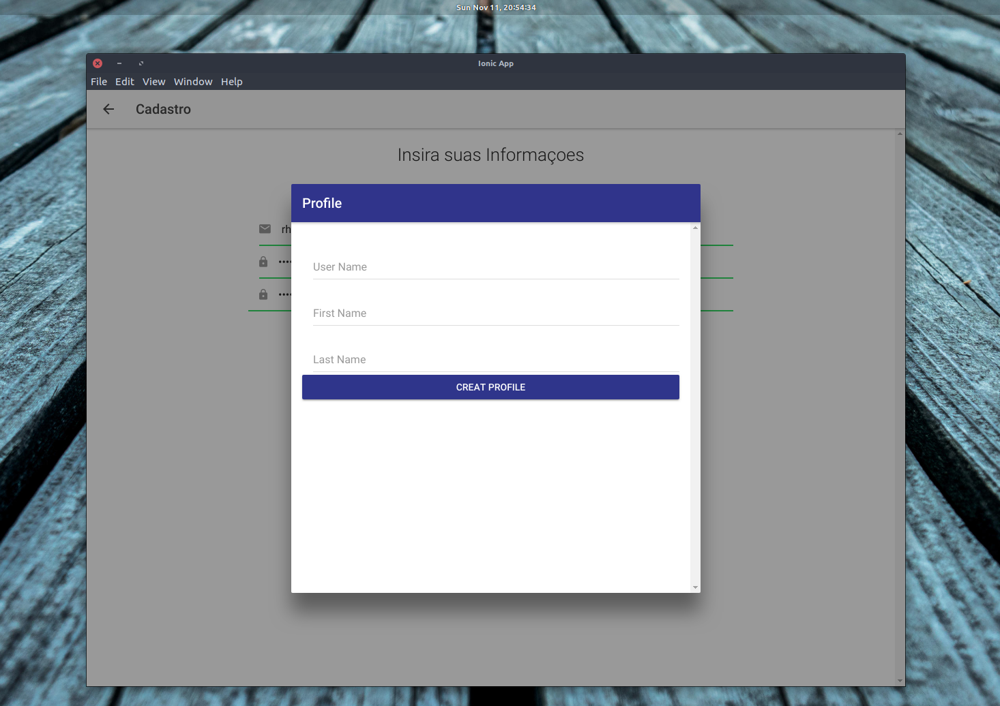
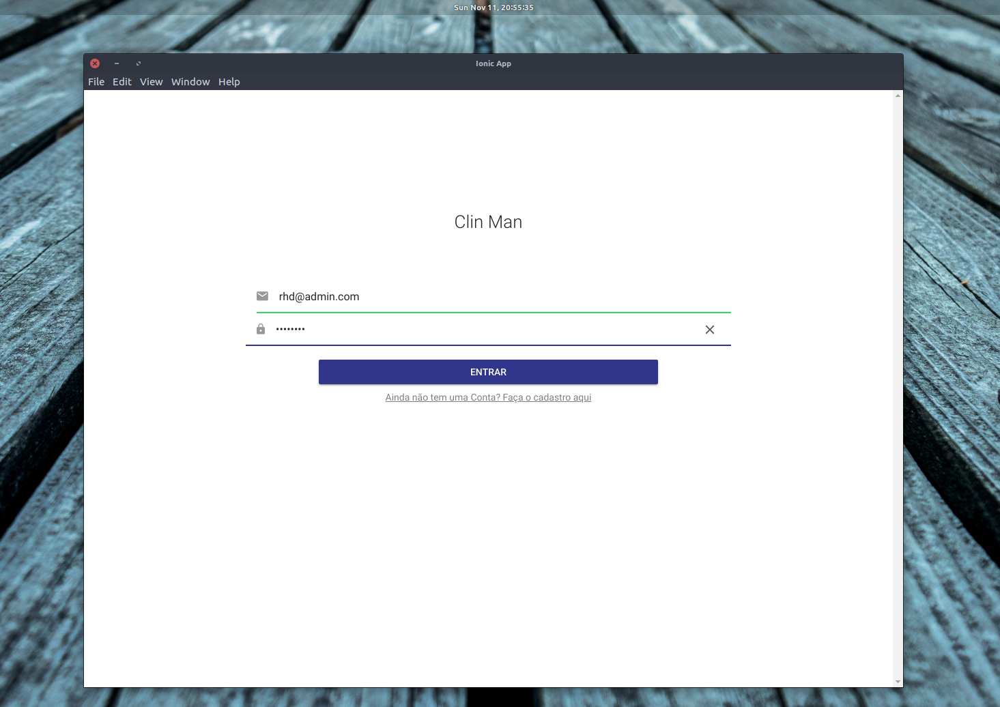
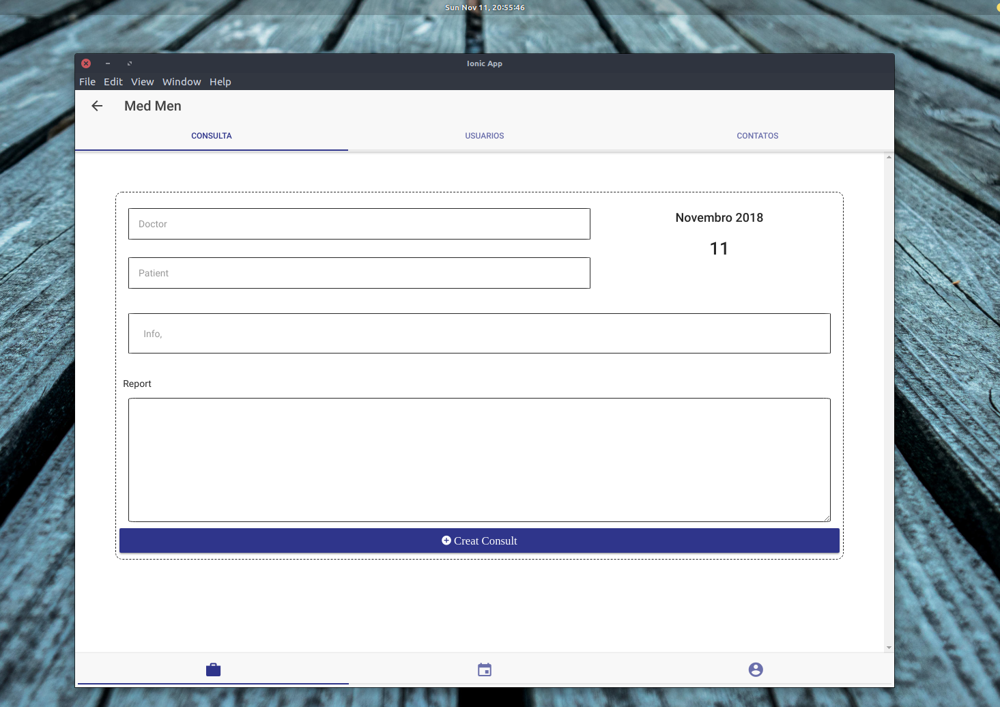
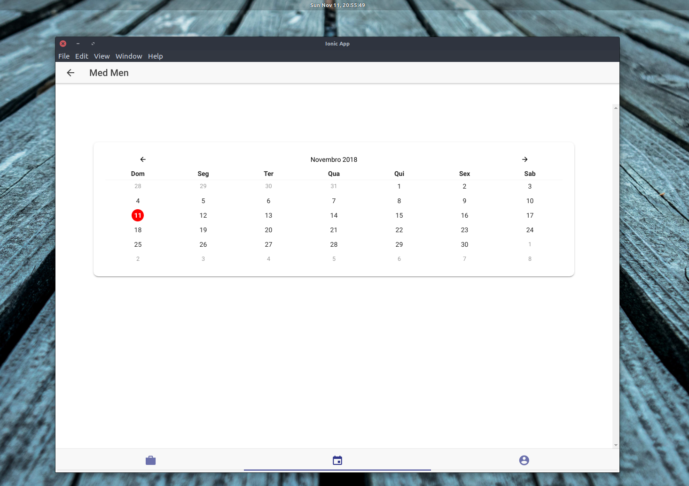
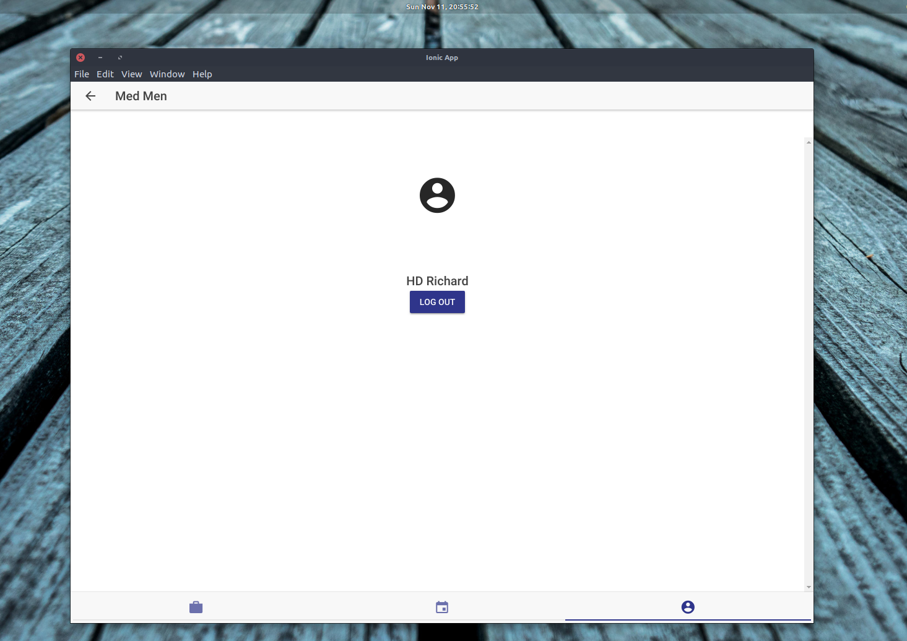

# MedMan

Med Man é uma plataforma para gerenciamento de uma clínica.

Tendo recursos como:

* Gerenciamento de Funcionários e Pacientes
* Marcação de consultas
* Disponibilização de Avisos da Direção do hospital

A plataforma possui suporte para:

* Web
* Desktop
* Android 
* IOS

## Mobile Demo

## Login
Login com email e senha.

## Sigin
Cadastre-se com seu nome, email e senha.

## Profile
Perfil. 

## Auth
Autenticaçao segura...
 - Verificação com hash e criptografica.
 - Ascesso HTTPS
 - Banco de dados no GOOGLE CLOUD

## Medical Consultation
Marcação e agendamento de consultas.

## Calender
Agenda personalizada.

## Logout

